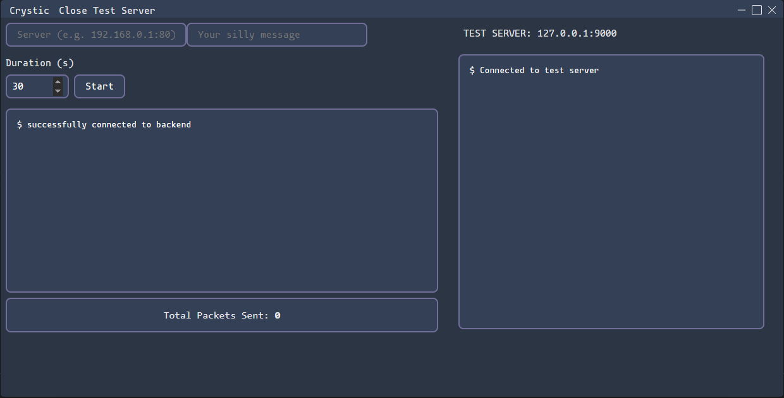

# TCP server testign tool

### Sends random packets and message of choice.

### Includes builtin tcp server for testing

# Instalation
## requires node.js version 20 or higher
` git clone https://github.com/JewelDesu/tcp-testing-tool.git `  
` cd tcp-testing-tool `  
`npm install `  
### dev mode
` npm run dev `

## compiling for different platforms
### Windows
` nom run dist:win `
### Linux
` npm run dist:linux `
### Mac
` npm run dist:mac `
